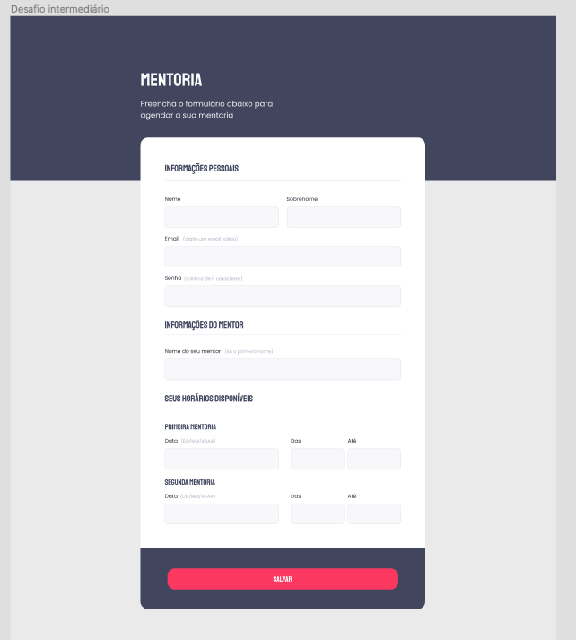
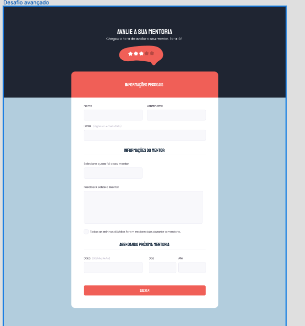

# Exercício branch main
[Figma](https://www.figma.com/file/zIn1MXnoEAQNxsOzsLahAD/Stage-03---Formul%C3%A1rio-intermedi%C3%A1rio-(Copy)?node-id=3%3A4&t=JLcnXM2TuIb4muVR-0)

 

# Exercício branch challenge 
[Figma](https://www.figma.com/file/Cawkd9ce6lImPzPqhexJvS/Stage-03---Formul%C3%A1rio-avan%C3%A7ado-(Copy)?node-id=0%3A1&t=bOVvnIlTWEpbbTTa-0)

