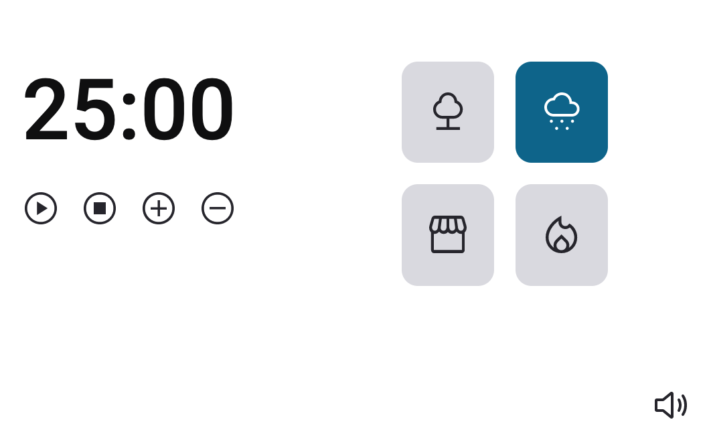
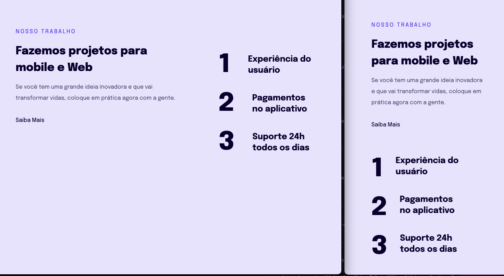
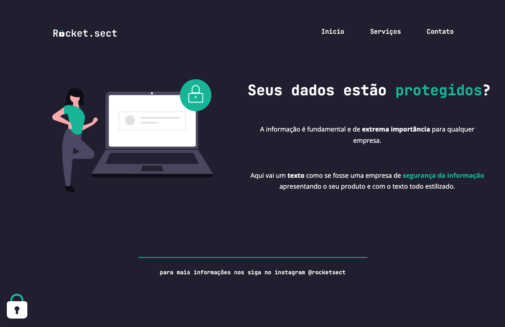
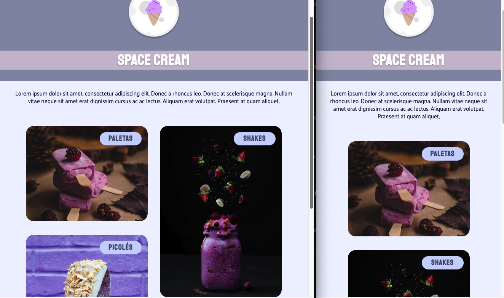
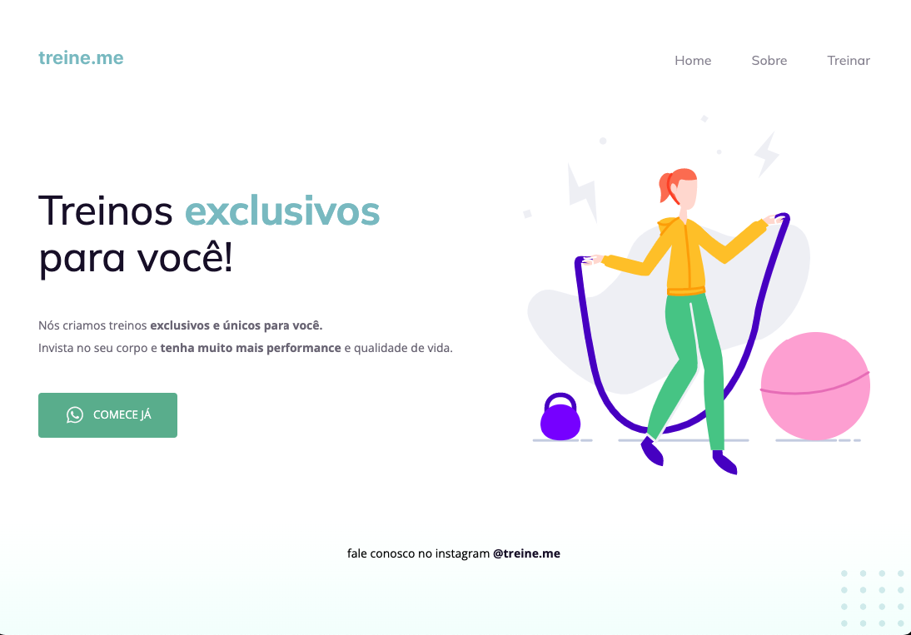

# Projeto de Web Front-end

Uma série de projetos sobre <strong>web front-end</strong> desenvolvidos para estudo utilizando apenas HTML, CSS e Javascript

 

<table style="width:80%">

  <tr>
    <td>
      
    </td>
    <td>
      <a href="./Biscoito%20da%20Sorte/">Biscoito da Sorte</a>
    </td>
  </tr>
  <tr>
    <td>
      
    </td>
    <td>
      <a href="./Calculo IMC/">Calculo IMC</a>
    </td>  
  </tr>
  <tr>
    <td>
      
    </td>
    <td>
      <a href="./Formulário Mentoria/">Formulário Mentoria</a>
    </td>  
  </tr>
  <tr>
    <td>
      
    </td>
    <td>
      <a href="./Formulário Simples/">Formulário Simples</a>
    </td>  
  </tr>
  </tr>
    <tr>
    <td>
      
    </td>
    <td>
      <a href="./Jogo da Adivinhação/">Jogo da Adivinhação</a>
    </td>  
  </tr>
  <tr>
    <td>
      
    </td>
    <td>
      <a href="./Pomodoro/">Pomodoro</a>
    </td>  
  </tr>
  <tr>
    <td>
      
    </td>
    <td>
      <a href="./Resposividade/">Resposividade</a>
    </td>  
  </tr>
<tr>
    <td>
      
    </td>
    <td>
      <a href="./Rocket.sect/">Rocket.sect</a>
    </td>  
  </tr>
<tr>
    <td>
      
    </td>
    <td>
      <a href="./Sorveteria/">Sorveteria</a>
    </td>  
  </tr>
<tr>
    <td>
      
    </td>
    <td>
      <a href="./TreineMe/">Primeiro Projeto</a>
    </td>  
  </tr>
</table>

